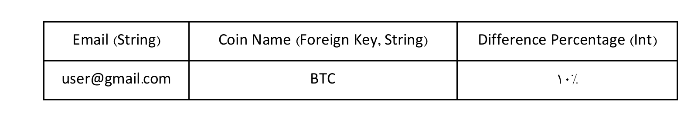

# Cloud Computing Projects

## Project 1, 2, 3

...

## Final Project

Implementation of multiple services with help of `docker` and `docker-compose`.

### Overall schema of services:


### Database schemas:

Prices:


Subscriptions:



### Services

There are two services:

- **Bepa**: Requests the coin-news services and writes the latest prices; also notifies subscriptions
  if the amount of increase in their favorite coin is greater than equal the difference percentage.
- **Peyk**: Provides two url endpoints that you can use the entire system with them.

### End-Points

There are two endpoints that you can use:

```shell
POST http:HOST/:name/subscribe

body: {
  "email": "your-email@test.com",
  "differencePercentage": 10
}
```

You can use this endpoint to subscribe for a specific coin, and if the increase of amount in that coin
is greater than `differencePercentage` you will be notified by email.

```shell
GET http:HOST/:name/price
```

You can get price history of specific coin by giving it's name.

### Suppoerted Coins

Supported coin names are: `bitcoin` and `docoin

### Run

You can start this application by following command: (note: you need to configure .env files before)

```shell
docker compose up --build -d
```
